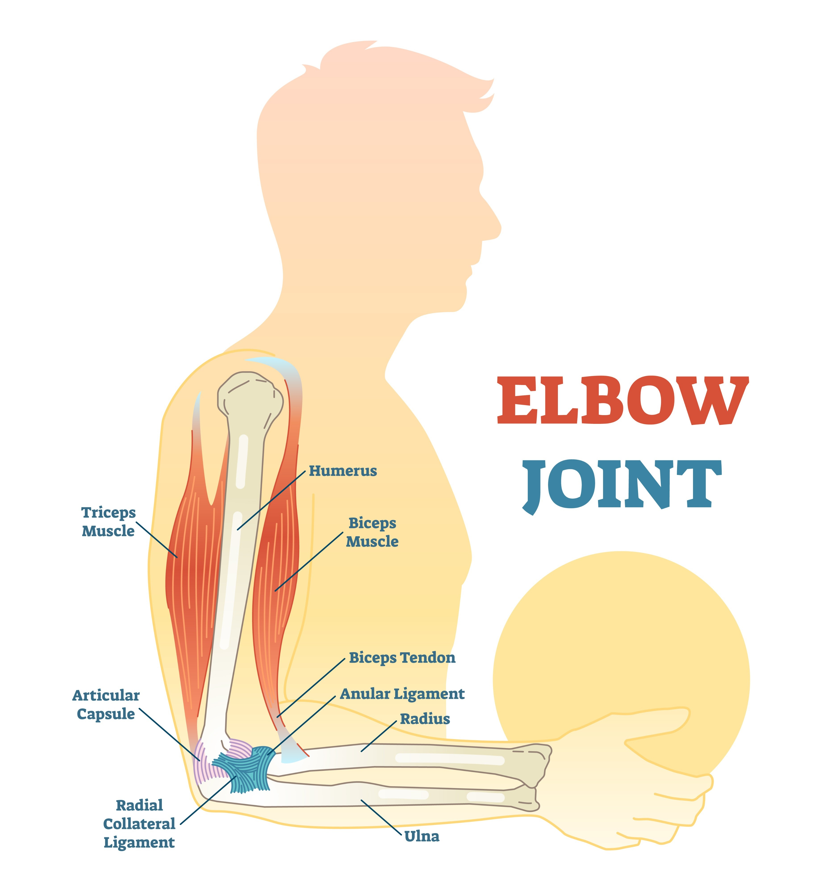

HAND ASSISTANCE REPORT

ELBOW JOINT

Max Flexion Torque (Rotational force causing the joint to bend):
Right:  46.00 Nm  |  Left:  36.47 Nm
Max Vertical Load (Upward or downward weight bearing force):
Right:  71.94 N   |  Left:  47.13 N

WRIST JOINT
Max Flexion Torque (Rotational force causing the joint to bend):
Right: 138.40 Nm  |  Left:   2.22 Nm
Max Vertical Load (Upward or downward weight bearing force):
Right: 441.98 N   |  Left:   7.70 N

