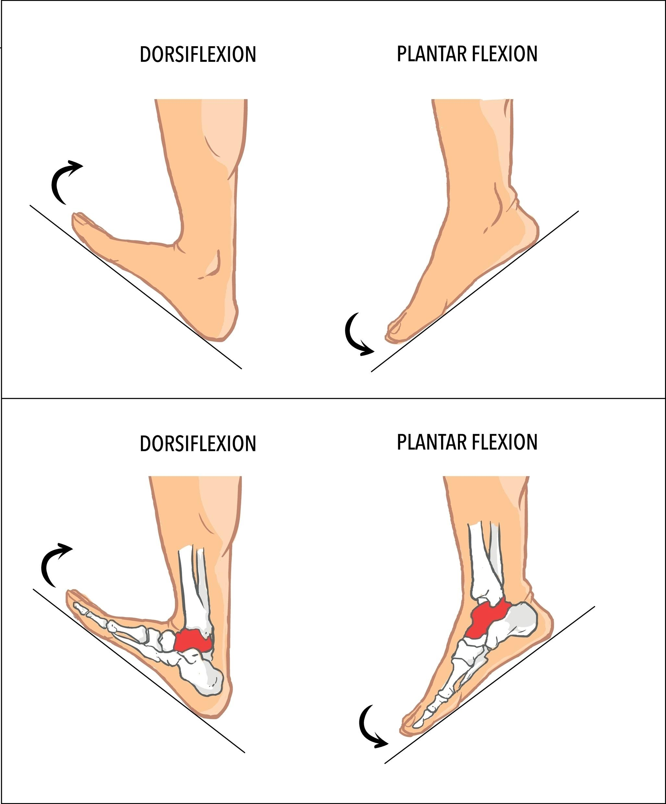

HUMAN LEG FORCE ANALYSIS

HIP JOINT

Max Flexion Torque (Rotational force causing the joint to bend):
Right:  37.83 Nm  |  Left: 507.37 Nm

Max Abduction Torque (Rotational force moving the limb away from the body center):
Right:  64.06 Nm  |  Left: 200.92 Nm

Max Vertical Load (Upward or downward weight bearing force):
Right: 3240.41 N   |  Left: 15700.66 N

KNEE JOINT

Max Flexion Torque (Rotational force causing the joint to bend):
Right:  25.37 Nm  |  Left:  78.39 Nm

Max Vertical Load (Upward or downward weight bearing force):
Right: 2181.18 N   |  Left: 5229.74 N

ANKLE JOINT

Max Plantar Torque (Rotational force pointing the foot downward):
Right:  81.83 Nm  |  Left:  75.69 Nm

Max Lateral Force (Side to side balancing force):
Right: 298.76 N   |  Left: 1627.93 N

