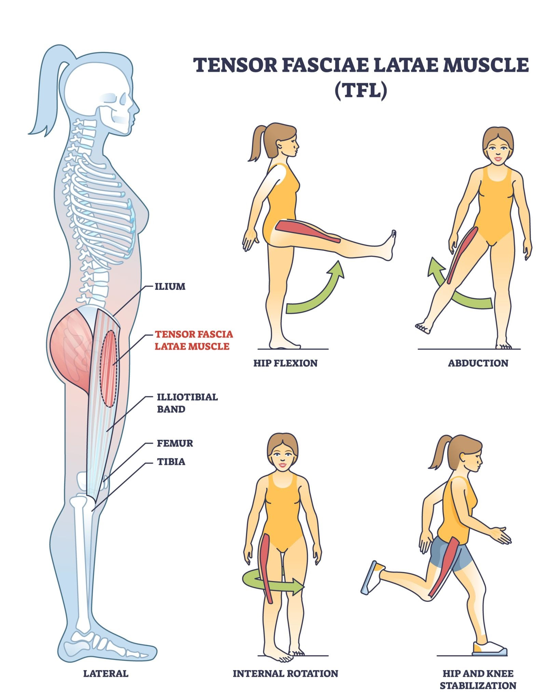

# KINEMATICS AND RANGE OF MOTION REPORT

### HIP KINEMATICS

The right hip required a flexion (bending a joint to decrease the angle between bones) range of motion (ROM) (the full movement potential of a joint) of 30.42 degrees, while the left hip required 38.05 degrees.

In terms of side to side stabilization, the right hip abduction (moving a limb away from the center line of the body) ROM was 17.99 degrees compared to 18.53 degrees on the left side.

### KNEE KINEMATICS

The right knee traveled through a flexion (bending a joint to decrease the angle between bones) ROM of 60.15 degrees. The left knee traveled through a flexion (bending a joint to decrease the angle between bones) ROM of 76.44 degrees. This shows the difference in leg bending when utilizing the helper rod.

### ANKLE KINEMATICS

The right ankle exhibited a plantarflexion (pointing the foot downward) ROM of 27.36 degrees. The left ankle exhibited a plantarflexion (pointing the foot downward) ROM of 57.17 degrees.

### ARM AND ROD SUPPORT KINEMATICS

While supporting the body with the rod, the right elbow went through a flexion (bending a joint to decrease the angle between bones) ROM of  6.76 degrees, and the right wrist went through a flexion (bending a joint to decrease the angle between bones) ROM of  3.36 degrees. By contrast, the unassisted left elbow and wrist showed minimal ROM of 20.11 degrees and 11.54 degrees respectively.

